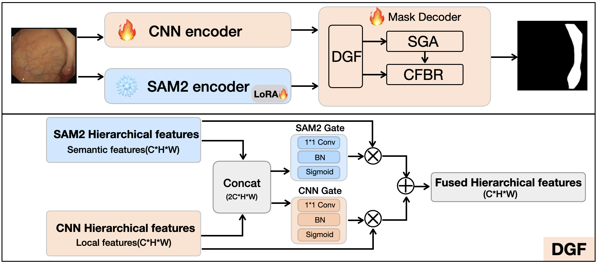
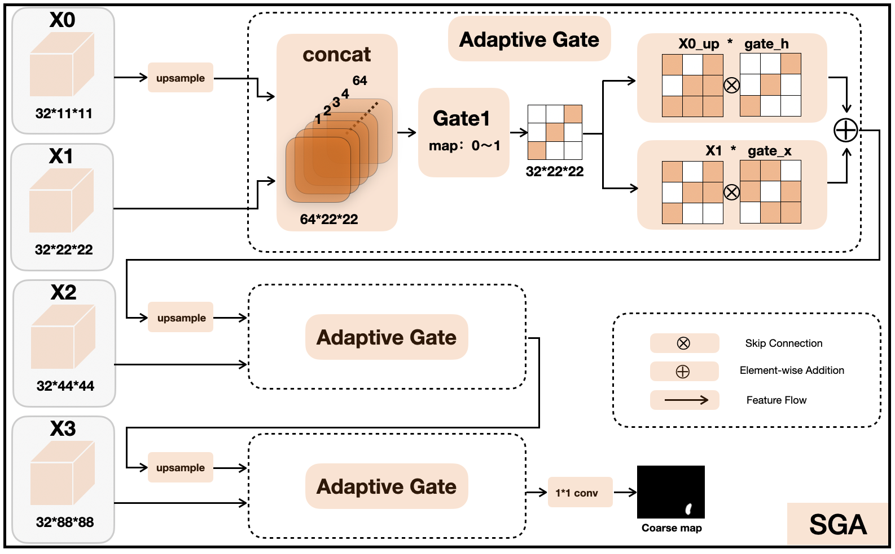
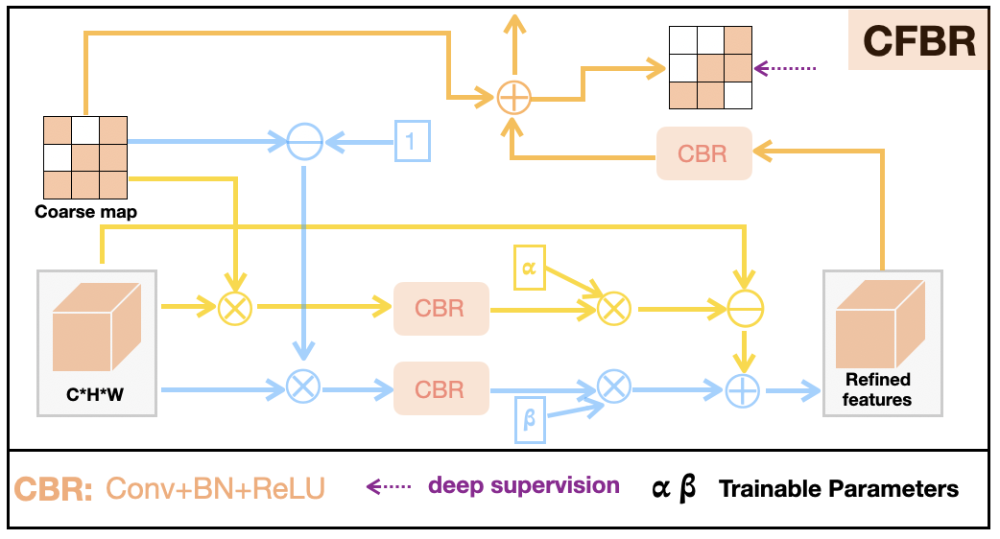

# SAM2-polyp

## Complementary Fusion of LoRA-Adapted SAM2 Semantics and OverLoCK Local Details for Cross-Dataset Polyp Segmentation

Research code for **RePraNet3**, a dual-representation network for medical polyp segmentation. The paper argues that robust cross-dataset segmentation needs both high-level semantic transfer from a foundation model and fine local detail from a task-trained convolutional encoder.

## Overview

RePraNet3 combines the hierarchical features of **SAM2 Hiera-L** with the multi-scale local features of **OverLoCK-T**. LoRA is inserted into the SAM2 attention projections while the original SAM2 weights remain frozen. The two feature pyramids are aligned and fused at four scales, then refined by multi-scale feature enhancement, semantic gated aggregation, and collaborative foreground--background refinement.

  

<em>Overall architecture: SAM2 semantic features and OverLoCK local features are fused before multi-scale mask refinement.</em>

## Method

- **Semantic branch:** SAM2 Hiera-L provides transferable hierarchical representations; LoRA updates the query--key--value and output projections without fine-tuning the complete foundation model.
- **Local-detail branch:** OverLoCK-T supplies task-specific texture, shape, and boundary cues at multiple resolutions.
- **Dual-gated fusion:** Same-scale feature pairs are aligned with lightweight projections and fused by four DualGateFusion modules.
- **Progressive refinement:** MFE, SGA, and CFBR produce coarse-to-fine predictions with deep supervision.

### Spatial/scale-guided aggregation

The SGA module uses adaptive gates to aggregate multi-scale features and produce a coarse segmentation map.

  

<em>Adaptive gated aggregation across the hierarchical feature maps.</em>

### Collaborative foreground--background refinement

CFBR uses the coarse prediction to guide foreground and background feature refinement at multiple resolutions.

  

<em>Collaborative foreground--background refinement for boundary-aware prediction.</em>

## Results

The current rank-32 checkpoint reports the following Dice and IoU scores on five public polyp datasets. Dice is the primary metric in the paper narrative; IoU is included for detailed comparison.

| Dataset | Dice | IoU |
|---|---:|---:|
| Kvasir-SEG | **0.9351** | **0.8934** |
| CVC-ClinicDB | **0.9562** | **0.9174** |
| CVC-300 | **0.9089** | **0.8472** |
| CVC-ColonDB | **0.8584** | **0.7928** |
| ETIS-LaribPolypDB | **0.8530** | **0.7923** |
| **Macro average** | **0.9023** | **0.8486** |

These results support the paper's central claim: foundation-model semantics and convolutional local details are complementary for cross-dataset polyp segmentation.

## Pretrained Model

The trained SAM2-polyp checkpoint is available on Hugging Face:

[Download Model Weights](https://huggingface.co/leojobs/SAM2-polyp)

## Code

This repository contains the implementation accompanying the paper and is intended for research reproduction and further study.
